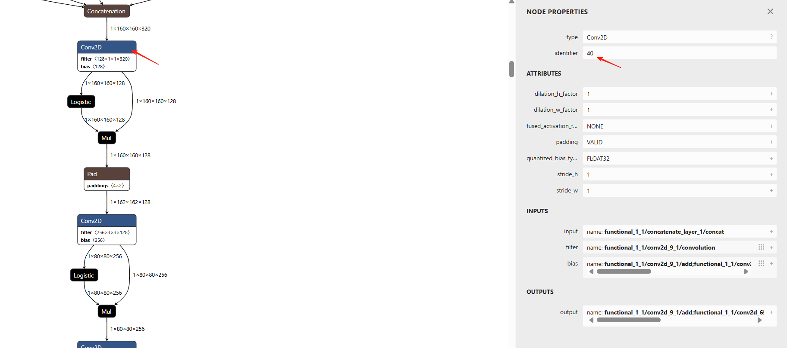
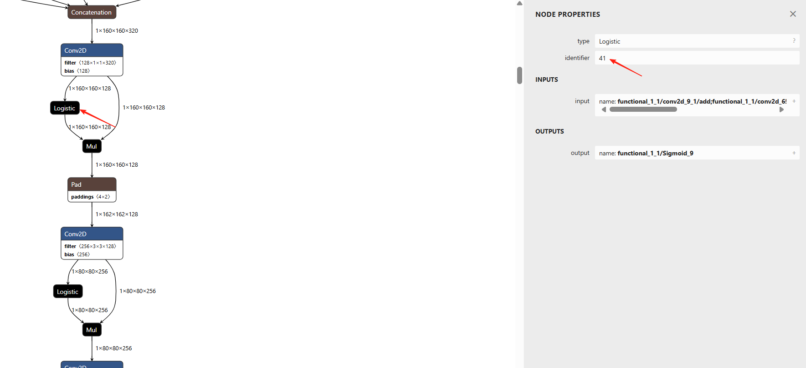

# AMLNNLite 使用文档

---

## 1. 概述

**AMLNNLite ** 是 Amlogic 提供的一套面向边缘计算场景的 Python 神经网络推理工具，封装的 API 包括模型加载、推理执行、性能分析和可视化能力等，使用户能在端侧 Ubuntu 环境下控制 **NPU** 进行模型推理。

核心目标：

- 简化端侧推理流程，避免直接使用 C API
- 快速验证模型在 Amlogic NN 平台上的可行性与性能
- 提供端侧的调试、分析与优化能力

## 2. 功能与 API

### 2.1 AMLNNLite 类接口

所有推理相关操作均通过 `AMLNNLite` 类完成。

#### 2.1.1 AMLNNLite()

**功能**：

- 创建并初始化一个 AMLNNLite 实例，用于后续模型配置与推理

```python
from amlnnlite.api import AMLNNLite
amlnn = AMLNNLite()
```

#### 2.1.2 config(...)

```python
amlnn.config(board_work_path, model_path, run_cycles, loglevel)
```

**功能**：

- 配置板端工作路径、模型路径及运行参数（需在 `init()` 前调用）

**参数说明**：

| 参数名 | 类型 | 说明 |
|----|----|----|
| board_work_path | str | 板端工作路径，默认 `/data/nn` |
| model_path | str | 模型路径，支持 `.adla` 或量化 `.tflite` |
| run_cycles | int | 推理循环次数，默认 `1` |
| loglevel | str | 日志等级：DEBUG / INFO / WARNING / ERROR，默认`ERROR` |

#### 2.1.3 init()

```python
amlnn.init()
```

**功能**：

- 初始化推理环境
- 加载模型并分配 NPU 资源

#### 2.1.4 inference(...)

```python
outputs = amlnn.inference(
    inputs,
    inputs_data_format,
    outputs_data_format,
    dequantize_outputs
)
```

**功能**：

- 执行模型推理并返回结果

**参数说明**：

| 参数 | 说明 |
|----|----|
| inputs | 输入数据列表（`list[np.ndarray]`） |
| inputs_data_format | 输入格式：NHWC / NCHW，默认 NHWC |
| outputs_data_format | 输出格式：NHWC / NCHW，默认 NHWC |
| dequantize_outputs | 是否对输出进行反量化，默认 True |

#### 2.1.5 uninit()

```python
amlnn.uninit()
```

**功能**：

- 释放推理资源并卸载模型

#### 2.1.6 visualize()

```python
amlnn.visualize()
```

**功能**：

- 可视化推理结果，展示逐层耗时与带宽信息

### 2.2 模型推理流程

典型 Python 推理流程如下：

```python
amlnn = AMLNNLite()
amlnn.config(...)
amlnn.init()

# preprocess inputs
outputs = amlnn.inference(inputs)
# postprocess outputs

amlnn.visualize()

amlnn.uninit()
```

通过 AMLNNLite 提供的 Python 系列接口，用户能够直接在板端 Unbuntu 环境使用 Python 脚本来执行特定操作完成量化模型在板端的推理任务并获取端侧的推理结果。这样做就能在测试阶段避免直接使用 NNSDK 接口（C API），简化了端侧推理的复杂性，为用户提供了一个灵活且高效的工作流程。

在获得推理结果之后，用户还可以在同一个 Python 脚本中添加专门的后处理代码，对推理结果进行进一步的分析和处理，从而实现模型的具体应用功能。

### 2.3 性能指标与日志

在配置 config 参数时，将 loglevel 设置成 INFO 级别，用户可以在模型推理完成后，获得关于模型运行的重要性能指标，包括NPU的总耗时和带宽使用情况，提供给用户实时的反馈。

```python
amlnn.config(..., loglevel='INFO')
```

### 2.4 可视化分析

AMLNNLite 提供的 visualize 接口，允许用户通过直观图形化界面，观察和分析量化模型在端侧执行推理时的详细性能指标。主要是各个 layer 的耗时和带宽等信息。该项功能便于用户快速识别和解决可能的性能瓶颈，优化模型的整体表现。

```python
amlnn.visualize()
```

## 3. 环境准备

### 系统要求

- OS：Ubuntu 22.04
- Python：3.10

### 3.1 确认 NPU 驱动版本

串口执行命令

```bash
dmesg | grep adla
strings /usr/lib/libadla.so | grep LIBADLA
```

驱动版本需要在 1.7.x 以上。

### 3.2 安装 Miniforge

如果系统中同时有多个版本的 Python 环境，建议使用 Anaconda 或 Miniforge 管理 Python 环境。这里以 Miniforge 为例。

```bash
wget https://github.com/conda-forge/miniforge/releases/latest/download/Miniforge3-Linux-aarch64.sh
chmod 777 Miniforge3-Linux-x86_64.sh
bash Miniforge3-Linux-x86_64.sh
```

### 3.3 创建虚拟环境

安装 Anaconda 或者 Miniforge 后，创建 python3.10 的虚拟环境并激活。

```bash
conda create -n python-nnsdk_310 python=3.10
conda activate python-nnsdk_310
```

### 3.4 安装whl包及依赖

whl 包放置于 /xxx/amlnnlite-x.x.x-cp310-cp310-linux_aarch64.whl

安装 whl 包时会自动安装其所需的其余依赖

```bash
pip install amlnnlite-x.x.x-cp310-cp310-linux_aarch64.whl
```

## 4. Demo 运行指南

### 4.1 模型下载与转换

模型下载脚本放置于 /xxx/01_export_model/download.sh，进入到该目录执行 download.sh 脚本，即可下载模型到本地。

```bash
cd /xxx/01_export_model/download.sh
./download.sh
```

模型转换请参考 **Model Conversion User Guide (x.x)_CN.pdf**，对下载好的模型进行转换，完成模型转换后，将生成的模型文件拷贝到 01_export_model 中。

### 4.2 MobileNetV2 Demo

模型推理脚本放置于 /xxx/mobilenetv2/02_verify_python/mobilenetv2.py，进入到该目录执行该脚本。

```bash
cd /xxx/mobilenetv2/02_verify_python

python mobilenetv2.py \
  --board-work-path /data/nn \
  --model-path ../01_export_model/mobilenet_v2_1.0_224_quant.adla \
  --run-cycles 1 \
  --loglevel INFO
```

运行成功后应该出现如下类似 log，包括硬件平台信息，模型输入输出基本信息，npu 耗时，带宽总消耗等等。

```
......
I Hardware platform: S905X5 (Type: 4)
I Model tensor info - Inputs: 1, Outputs: 1
I Input[0] - Shape: (1, 224, 224, 3), Elements: 150528, Stride: 1, Size: 150528bytes, Format: NHWC, Type: 0, Quantization: scale=0.007812, zp=128
I Output[0] - Shape: (1, 1, 1, 1001), Elements: 1001, Stride: 1, Size: 1001bytes, Format: NHWC, Type: 0, Quantization: scale=0.098893, zp=58
I Average time: 2.396250009536743 ms
I FPS: 417.3187255859375
I Bandwidth: 3.143280029296875 Mbytes
......
```

该 demo 的测试输入用的是 01_export_model 中的所有图片，用户如有想测试的图片，可以直接将测试图片放入 01_export_model 中，或者直接修改 demo 中的逻辑来达到自己想要测试的效果。

### 4.3 YOLOv8 Demo

注：如果要测试 yolov8 的 demo，还需要额外安装一个 requirements.txt，这是因为 yolov8 涉及到 pt 到 onnx 的转换以及相较于分类稍复杂的前后处理动作，故需要额外装一个 requirements.txt 依赖，该 txt 放置于 /xxx/yolov8/requirements.txt

```bash
pip install -r requirements.txt
```

模型推理脚本放置于 /xxx/yolov8/02_verify_python/yolov8.py，进入到该目录执行该脚本。

```bash
cd /xxx/yolov8/02_verify_python

python yolov8.py \
  --board-work-path /data/nn \
  --model-path ../01_export_model/yolov8l.adla \
  --run-cycles 1 \
  --loglevel INFO
```

运行成功后应该出现如下类似 log，包括硬件平台信息，模型输入输出基本信息，npu 耗时，带宽总消耗等等。

```
......
I Hardware platform: S905X5 (Type: 4)
I Model tensor info - Inputs: 1, Outputs: 3
I Input[0] - Shape: (1, 640, 640, 3), Elements: 1228800, Stride: 1, Size: 1228800bytes, Format: NHWC, Type: 1, Quantization: scale=0.003922, zp=-128
I Output[0] - Shape: (1, 40, 40, 144), Elements: 230400, Stride: 1, Size: 230400bytes, Format: NHWC, Type: 1, Quantization: scale=0.220622, zp=65
I Output[1] - Shape: (1, 80, 80, 144), Elements: 921600, Stride: 1, Size: 921600bytes, Format: NHWC, Type: 1, Quantization: scale=0.243528, zp=61
I Output[2] - Shape: (1, 20, 20, 144), Elements: 57600, Stride: 1, Size: 57600bytes, Format: NHWC, Type: 1, Quantization: scale=0.181026, zp=56
I Average time: 91.38200378417969 ms
I FPS: 10.943074226379395
I Bandwidth: 503.4038391113281 Mbytes
......
```

带有框信息的结果图片会保存在当前路径的 yolov8_result 文件夹内，示例图片结果如下


该 demo 的测试输入用的是 01_export_model 中的所有图片，用户如有想测试的图片，可以直接将测试图片放入 01_export_model 中，或者直接修改 demo 中的逻辑来达到自己想要测试的效果。

### 4.4 Online 推理流程（TFLite）

目前 AMLNNLite 支持在线编译流程，允许用户直接以量化 tflite 作为模型输入，内部会自动将 tflite 转换成 adla 格式，底层推理依然是在 npu 上跑 adla 模型。 **量化 TFLite → 在线编译 → ADLA → NPU 推理**。

为了生成量化 tflite，用户需要在模型转换之前设置环境变量

```bash
export ADLA_EXPORT_MIDDLE_TO_TFLITE=True
```

然后再进行模型转换，这样会在生成 adla 文件的同时，导出对应的量化 tflite 文件。（用户可在 PC 端对该量化 tflite 进行仿真，先确保量化 tflite 模型的精度相较于原始模型的精度 drop 在可接受的范围内，adla 是基于量化 tflite 生成的，如果 tflite 精度都不对，那 adla 的精度肯定也不对）

在得到了量化 tflite 后，只需将上述 4.2 & 4.3 节中运行 demo 命令的 --model-path 参数替换为对应的量化 tflite 模型路径即可。

```bash
Mobilenet
python mobilenetv2.py \
......
    --model-path ../01_export_model/mobilenet_v2_1.0_224_quant.tflite \
......


yolov8
python yolov8.py \
......
    --model-path ../01_export_model/yolov8l.tflite \
......
```

### 4.5 可视化结果说明

在成功运行 demo 后，会在当前 demo 脚本路径下生成一个与模型名相同的文件夹，该文件夹包含 5 个 html 文件，用于直观且详细地可视化模型逐层的性能信息。

- `hard_op_chart.html`
- `soft_op_chart.html`
- `dram_rd_chart.html`
- `dram_wr_chart.html`
- `pie_charts_distribution.html`

以 hard_op_chart.html 举例，如下所示，图中每一层的算子名称为 adla 算子名称，名称后面会跟一个小括号，里面的数字代表该 adla 算子所对应量化 tflite 某层或某几层，默认情况下，这些信息都会被隐藏，adla 算子名称只会显示 hardware 或者 software，并且后面括号内不会有任何数值。


如果用户对这部分信息感兴趣，比如想对模型进行调优，需要知道 adla 层与 tflite 层的对应关系，那可以在模型转换前设置环境变量。

```bash
export ADLA_DUMP_MODEL_INFO=True
```

然后再转模型，这样生成的 adla 文件内会带上各层具体的名字以及对应原始 tflite 模型的具体层数，这些信息也会在可视化图中体现。


算子名后小括号中的数字表示该 adla 算子所映射的量化 tflite 模型的具体层数；用户可通过该映射关系定位到感兴趣的 adla 算子对应的 tflite 层位置，并进一步映射回原始模型的具体算子。





### 4.6 NPU利用率

查看 npu 利用率的脚本放置于 /xxx/NPU_utilization.py，在 demo 的运行过程中，再新开一个终端，执行如下命令即可实时查看 cpu 与 npu 的利用率。

```bash
python NPU_utilization.py
```

效果如图所示

 

需要注意的是，该脚本会以 50ms 间隔去读取一次设备端的 npu 利用率节点；只有当采样时刻恰好处于模型在 npu 上运行过程中，才会显示非零的 npu 利用率；对于推理耗时较短的模型（如MobileNet，仅约2ms），大多数采样点将显示为 0；若希望更直观地观察 npu 的真实利用率，可在 demo 脚本中将 --run-cycles 参数调大，使模型在 npu 上连续推理多次，从而延长推理时间，便于采样。

## 5. FAQ

### 5.1 调试手段

将日志级别设置为DEBUG等级

```bash
export NN_SERVER_LOG_LEVEL=4
loglevel='DEBUG'
```

### 5.2 输入输出格式

输入：adla 的输入是 nhwc 格式的，但用户在使用 AMLNNLite 时可以给 nchw 的输入，只需要将 inference 接口中的 inputs_data_format 参数指定为 ’NCHW’ 即可，内部会自动做格式转换。

输出：adla 的输出是 nhwc 格式的，但用户在使用 AMLNNLite 时可以直接拿到 nchw 的输出，只需要将 inference 接口中的 outputs_data_format 参数指定为 ’NCHW’ 即可，内部会自动做格式转换。
