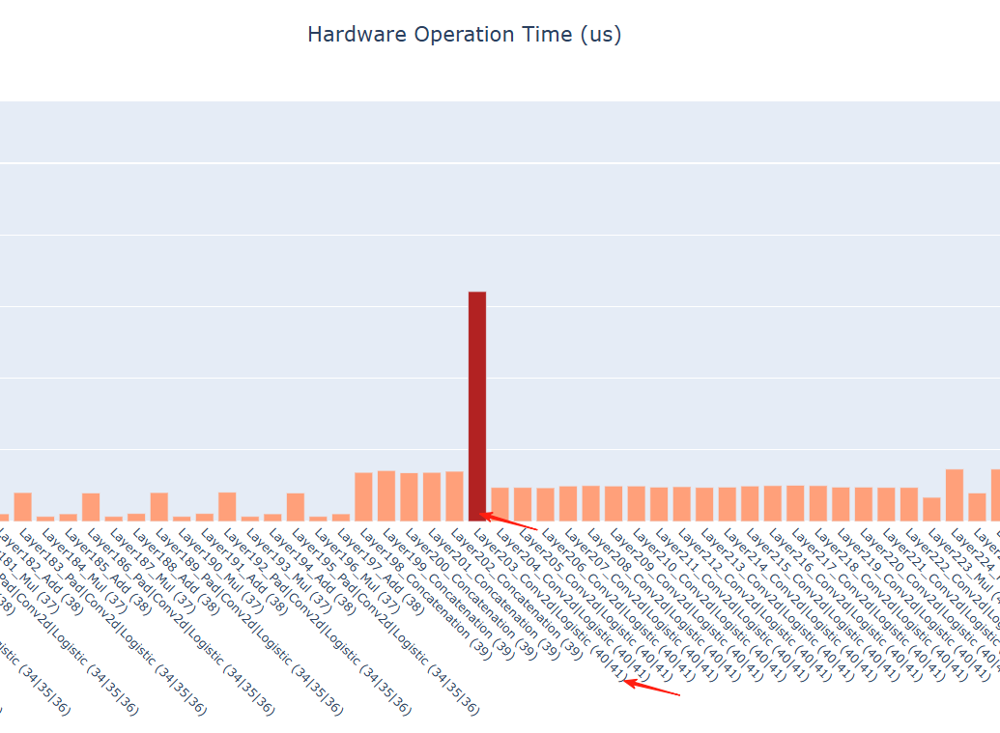
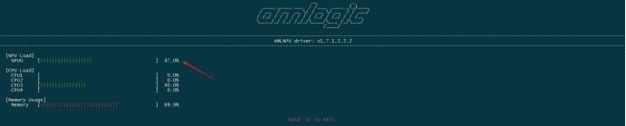

# AMLNNLite: Amlogic Edge AI Inference Toolkit (Python)

AMLNNLite is a high-performance, developer-friendly Python toolkit designed for neural network inference on Amlogic NPU platforms. It abstracts complex C-based SDK interfaces into a streamlined Pythonic API, enabling rapid deployment, performance profiling, and model optimization in edge Ubuntu environments.

## 🚀 Key Features

- **Developer-Centric API**: Simplified workflow for model loading, configuration, and inference.
- **Deep Profiling**: Built-in visualization tools for layer-wise latency, bandwidth consumption, and NPU utilization.
- **Flexible Data Handling**: Automatic handling of data format conversions (NCHW ↔ NHWC) and dequantization.

---

## 🛠 Supported Examples

Accelerate your development with our curated list of model implementations:

| Model | Repository Link |
| :--- | :--- |
| **MobileNet** | [View on GitHub](https://github.com/Amlogic-NN/amlnn-toolkit/tree/main/example/mobilenetv2/02_verify_python) |
| **ResNet** | [View on GitHub](https://github.com/Amlogic-NN/amlnn-model-playground/tree/main/examples/resnet/py) |
| **YOLOv11** | [View on GitHub](https://github.com/Amlogic-NN/amlnn-model-playground/tree/main/examples/yolov11/py) |
| **YOLOv8** | [View on GitHub](https://github.com/Amlogic-NN/amlnn-model-playground/tree/main/examples/yolov8/py) |
| **YOLOWorld** | [View on GitHub](https://github.com/Amlogic-NN/amlnn-model-playground/tree/main/examples/yoloworld/py) |
| **YOLOX** | [View on GitHub](https://github.com/Amlogic-NN/amlnn-model-playground/tree/main/examples/yolox/py) |
| **RetinaFace** | [View on GitHub](https://github.com/Amlogic-NN/amlnn-model-playground/tree/main/examples/retinaface/py) |

---

## 💻 Environment Setup

### Prerequisites
- **OS**: Ubuntu 22.04 (aarch64)
- **Python**: 3.10
- **NPU Driver**: Version 1.7.x or higher

### Installation

1. **Verify NPU Driver**:
   ```bash
   dmesg | grep adla
   strings /usr/lib/libadla.so | grep LIBADLA
   ```

2. **Initialize Environment (Recommended: Miniforge)**:
   ```bash
   conda create -n amlnn_dev python=3.10 -y
   conda activate amlnn_dev
   ```

3. **Install Toolkit**:
   ```bash
   pip install amlnnlite-x.x.x-cp310-cp310-linux_aarch64.whl
   ```

---

## ⚡ Quick Start

Incorporate NPU inference into your Python application in just a few lines:

```python
from amlnnlite.api import AMLNNLite
import numpy as np

# 1. Initialize
amlnn = AMLNNLite()

# 2. Configure (adla or quantized tflite)
amlnn.config(board_work_path="/data/nn", model_path="model.adla", loglevel="INFO")

# 3. Setup Engine
amlnn.init()

# 4. Perform Inference
input_data = [np.random.randn(1, 224, 224, 3).astype(np.uint8)]
outputs = amlnn.inference(input_data)

# 5. Profile (Optional)
amlnn.visualize()

# 6. Cleanup
amlnn.uninit()
```

---

## 📖 API Reference Summary

### `AMLNNLite()`
Initialize the toolkit core engine.

### `config(board_work_path, model_path, run_cycles=1, loglevel="ERROR")`
Configure the runtime environment.
- `board_work_path`: Workspace on the board.
- `model_path`: Path to `.adla` or quantized `.tflite`.
- `run_cycles`: Number of iterations for profiling.

### `init()`
Load the model into the NPU and allocate hardware resources.

### `inference(inputs, inputs_data_format='NHWC', outputs_data_format='NHWC', dequantize_outputs=True)`
Execute synchronous inference.
- Handles padding/strips automatically.
- Supports on-the-fly format conversion and dequantization.

### `visualize()`
Generates comprehensive performance reports (HTML) for the last inference session.

---

## 🔍 Advanced Features & Insights


### 1. Layer-wise Visualization
Using `amlnn.visualize()`, developers can inspect:
- `hard_op_chart.html`: Hardware-accelerated operators.
- `soft_op_chart.html`: CPU fallback operators.
- `dram_rd/wr_chart.html`: Memory bandwidth analysis.
- `pie_charts_distribution.html`: Overall time distribution.

<div align="center">
  
  
</div>


### 2. NPU Utilization Monitoring
Use the provided `NPU_utilization.py` script to monitor hardware load in real-time during heavy inference tasks.

```bash
python NPU_utilization.py
```

<div align="center">
  
</div>


## 🛠 FAQ

- **Data Formats**: Native NPU format is NHWC. Use `inference(..., inputs_data_format='NCHW')` if your pre-processing yields NCHW; the toolkit handles the conversion efficiently.
- **Debugging**: For verbose logs, set `export NN_SERVER_LOG_LEVEL=4` and `loglevel='DEBUG'` in `config()`.
