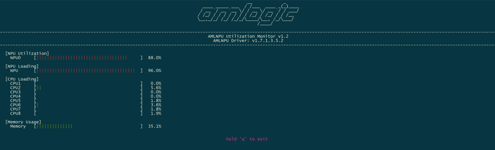

# 1. Usage Instructions

## 1.1 Connect the board to ADB and plug in the Ethernet cable
## 1.2 Open a PowerShell window and run `adb root`, `adb shell`, and `ifconfig` (to obtain the IP address)
## 1.3 Execute on the PC server
1) Method 1 (Linux):
adb connect 10.18.9.126 (IP address)
python3 NPU_utilization.py

2) Method 2 (Windows):
python NPU_utilization.py

# 2. The following information is displayed

