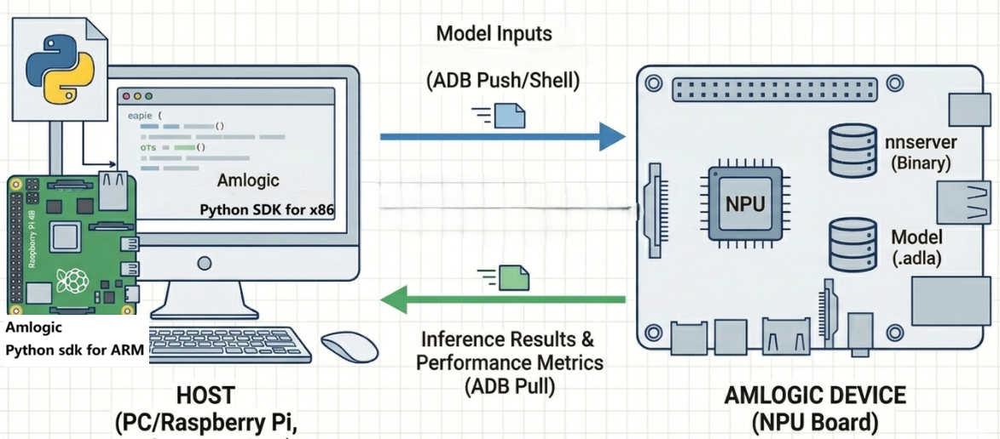

# Amlogic AI Python Toolkit (amlnn_toolkit)

This toolkit provides a Python interface for the full Amlogic NPU workflow: model conversion, quantization, compilation to `.adla` format, and inference. It supports two deployment modes:

- **x86 PC mode**: Run on a host PC. Inference is delegated to a connected Amlogic board via ADB, using `nnserver` as the on-device agent.
- **Debian board mode**: Install directly on an Amlogic Debian board and run the full workflow locally.



In PC mode, the host acts as the controller. The Python SDK prepares inputs, pushes the model and input files to the device over ADB, and triggers inference remotely. `nnserver` on the device loads the `.adla` model and executes inference on the NPU. Results and performance metrics are pulled back to the host for analysis.

## Key Features

- **Full Workflow**: Model import, quantization, compilation, and inference in one package.
- **Dual Mode**: Works from an x86 PC (via ADB + nnserver) or directly on a Debian board.
- **Deep Profiling**: Built-in visualization for layer-wise latency, bandwidth, and NPU utilization.

---

## Supported Examples

| Model | Repository Link |
| :--- | :--- |
| **MobileNet** | [View on GitHub](https://github.com/Amlogic-NN/amlnn-toolkit/tree/main/amlnn_toolkit/example/mobilenet) |
| **ResNet** | [View on GitHub](https://github.com/Amlogic-NN/amlnn-model-playground/tree/main/examples/resnet/py) |
| **YOLOv11** | [View on GitHub](https://github.com/Amlogic-NN/amlnn-model-playground/tree/main/examples/yolov11/py) |
| **YOLOv8** | [View on GitHub](https://github.com/Amlogic-NN/amlnn-model-playground/tree/main/examples/yolov8/py) |
| **YOLOWorld** | [View on GitHub](https://github.com/Amlogic-NN/amlnn-model-playground/tree/main/examples/yoloworld/py) |
| **YOLOX** | [View on GitHub](https://github.com/Amlogic-NN/amlnn-model-playground/tree/main/examples/yolox/py) |
| **RetinaFace** | [View on GitHub](https://github.com/Amlogic-NN/amlnn-model-playground/tree/main/examples/retinaface/py) |
| **Qwen** | [View on GitHub](https://github.com/Amlogic-NN/amlnn-toolkit/tree/main/amlnn_toolkit/example/qwen) |

---

## Environment Setup

### Prerequisites

- **Python**: 3.10
- **ADB**: Required for PC mode only
- **NPU Driver**: 2.0.2 or higher

> If multiple Python versions are installed, use **Miniforge** or **Anaconda** to manage environments.

### 1. Verify NPU Driver

Check the NPU driver version on the target device. Version **2.0.2 or higher** is required.

**Android:**

```bash
adb root
adb shell
dmesg | grep adla
# 64-bit
strings /vendor/lib64/libadla.so | grep LIBADLA
# 32-bit
# strings /vendor/lib/libadla.so | grep LIBADLA
```

**Linux (Buildroot / Yocto / Debian):**

```bash
adb shell
dmesg | grep adla
strings /usr/lib/libadla.so | grep LIBADLA
```

Expected output:

```
adla kmd version: 2.0.2.x.x
LIBADLA, v2.0.2.x.x.x, 20xx.xx
```

> **IMPORTANT**: If the driver version is too old, re-flash the device with the latest image. Contact your FAE or after-sales team for the image file.

### 2. Initialize Python Environment

```bash
# Install Miniforge if needed
wget https://github.com/conda-forge/miniforge/releases/latest/download/Miniforge3-Linux-x86_64.sh
bash Miniforge3-Linux-x86_64.sh

# Create and activate environment
conda create -n amlnn_toolkit_py310 python=3.10 -y
conda activate amlnn_toolkit_py310
```

### 3. Install the Python Wheel

**x86 PC (host mode):**

```bash
pip install amlnn_toolkit/whl/linux_x86/amlnn_toolkit-1.0.0-cp310-cp310-linux_x86_64.whl
```

**Debian board (native mode):**

```bash
pip install amlnn_toolkit/whl/aarch64/amlnn_edge_toolkit-1.0.0-cp310-cp310-linux_aarch64.whl
```

Expected output:
```
Successfully installed amlnn_toolkit-1.0.0
```

### 4. Deploy nnserver to Target (PC mode only)

Push the `nnserver` binary matching your target platform to the device.

**Android:**

```bash
adb root
adb shell "mkdir -p /data/nn"

# 64-bit
adb push amlnn_toolkit/nnserver/android/lib64/nnserver /data/nn/nnserver
# 32-bit
# adb push amlnn_toolkit/nnserver/android/lib32/nnserver /data/nn/nnserver

adb shell "chmod +x /data/nn/nnserver"
adb shell "cd /data/nn && export LD_LIBRARY_PATH=/system/lib64:/vendor/lib64:$LD_LIBRARY_PATH && ./nnserver &"
adb shell "ps -A | grep nnserver"
```

**Linux (Buildroot):**

```bash
adb shell "mkdir -p /data/nn"

# 64-bit
adb push amlnn_toolkit/nnserver/linux/buildroot/lib64/nnserver /data/nn/nnserver
# 32-bit
# adb push amlnn_toolkit/nnserver/linux/buildroot/lib32/nnserver /data/nn/nnserver

adb shell "chmod +x /data/nn/nnserver"
adb shell "/data/nn/nnserver &"
adb shell "ps -A | grep nnserver"
```

**Linux (Yocto / Debian):**

```bash
adb shell "mkdir -p /data/nn"

# 64-bit
adb push amlnn_toolkit/nnserver/linux/yocto/lib64/nnserver /data/nn/nnserver
# 32-bit
# adb push amlnn_toolkit/nnserver/linux/yocto/lib32/nnserver /data/nn/nnserver

adb shell "chmod +x /data/nn/nnserver"
adb shell "/data/nn/nnserver &"
adb shell "ps -A | grep nnserver"
```

Expected output:
```
root  2558  1  10834704  2708 futex_wait_queue_me 0 S nnserver
```

> If `nnserver` is already running, starting it again will print `bind() error`. Stop the existing process first.

---

## Quick Start

```bash
cd amlnn_toolkit/example/mobilenet

# Native mode (run directly on Debian board)
python mobilenet.py --mode native --target-platform 001

# nnserver mode (run from x86 PC, board connected via ADB)
python mobilenet.py --mode nnserver --target-platform 001
```

Upon success you will see SDK version info, Top-5 classification results, and NPU performance metrics.

---

## Demo Overview

The `mobilenet.py` demo covers the complete end-to-end workflow on a single MobileNetV2 model:

1. **Auto-download**: Downloads `mobilenet_v2_1.0_224_quant.tflite` and `labels.txt` automatically if not already present.
2. **Load**: Loads the quantized TFLite model.
3. **Config**: Sets quantization type (`w8a8`) and target platform.
4. **Compile**: Compiles the model to `.adla` format using the calibration dataset (`datasets.txt`).
5. **Export**: Saves the compiled `.adla` file.
6. **Init runtime**: Initializes the NPU runtime in the selected mode.
7. **Inference**: Runs inference on `fish_224x224.jpeg` and prints Top-5 classification results.
8. **Profiling**: Prints performance metrics and generates HTML visualization reports.

### Parameters

| Parameter | Values | Description |
| :--- | :--- | :--- |
| `--mode` | `native` (default), `nnserver` | `native`: run directly on the Debian board. `nnserver`: delegate inference to a board connected via ADB. |
| `--target-platform` | See table below | Target platform ID used during compilation. |

**Platform ID reference:**

| `--target-platform` | 平台            |
| :------------------ | :-------------- |
| `001`               | C308L / C302X   |
| `002`               | S928X           |
| `003`               | A311D2          |
| `004`               | T968D4          |
| `005`               | S905X5 / S905D5 |
| `006`               | C302X2          |
| `007`               | A311Y3          |
| `008`               | C305X2          |

### Visualization Output

`perf_visualize()` generates the following HTML reports in the current directory:

- `hard_op_chart.html`: Hardware operator latency.
- `soft_op_chart.html`: Software operator latency.
- `dram_rd/wr_chart.html`: Memory bandwidth analysis.
- `pie_charts_distribution.html`: Overall time distribution.

<div align="center">
  
  
</div>

---

## FAQ

- **nnserver bind error**: Only one `nnserver` instance can run at a time. Kill the existing process before starting a new one.
