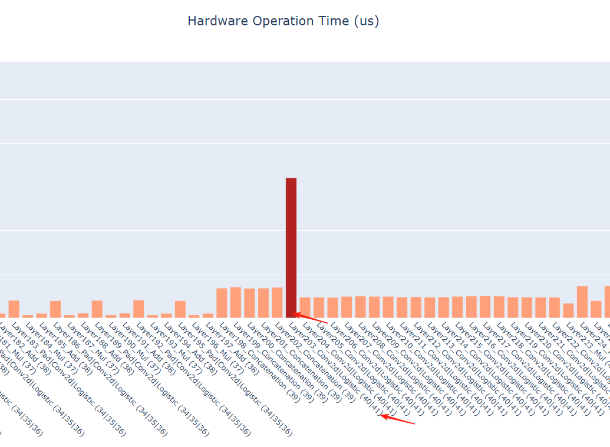
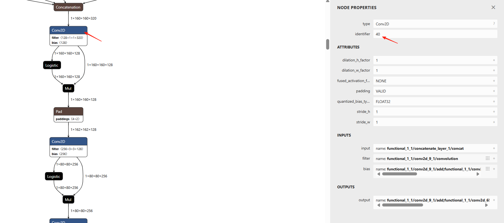

# AMLNNLite: Amlogic Edge Inference Toolkit (Python)

`amlnn_edge_toolkit_lite` provides a lightweight Python SDK for neural network inference on Amlogic NPU platforms. It is designed for running small models (e.g. CNN) directly on Debian boards — no host PC or ADB connection required.

## Key Features

- **On-device inference**: Runs entirely on the Amlogic Debian board.
- **Developer-friendly API**: Simple workflow for model loading, inference, and profiling.
- **Deep profiling**: Built-in visualization for layer-wise latency and bandwidth.

---

## Supported Examples

| Model | Repository Link |
| :--- | :--- |
| **MobileNet** | [View on GitHub](https://github.com/Amlogic-NN/amlnn-toolkit/tree/main/amlnn_toolkit_lite/amlnn_edge_toolkit_lite/example/base_api) |
| **ResNet** | [View on GitHub](https://github.com/Amlogic-NN/amlnn-model-playground/tree/main/examples/resnet/py) |
| **YOLOv11** | [View on GitHub](https://github.com/Amlogic-NN/amlnn-model-playground/tree/main/examples/yolov11/py) |
| **YOLOv8** | [View on GitHub](https://github.com/Amlogic-NN/amlnn-model-playground/tree/main/examples/yolov8/py) |
| **YOLOWorld** | [View on GitHub](https://github.com/Amlogic-NN/amlnn-model-playground/tree/main/examples/yoloworld/py) |
| **YOLOX** | [View on GitHub](https://github.com/Amlogic-NN/amlnn-model-playground/tree/main/examples/yolox/py) |
| **RetinaFace** | [View on GitHub](https://github.com/Amlogic-NN/amlnn-model-playground/tree/main/examples/retinaface/py) |

---

## Environment Setup

### Prerequisites

- **OS**: Debian
- **Python**: 3.10
- **NPU Driver**: 2.0.2 or higher

> If multiple Python versions are installed, use **Miniforge** or **Anaconda** to manage environments.

### 1. Verify NPU Driver

Check the NPU driver version on the target device. Version **2.0.2 or higher** is required.

```bash
dmesg | grep adla
strings /usr/lib/libadla.so | grep LIBADLA
```

Expected output:

```
adla kmd version: 2.0.2.x.x
LIBADLA, v2.0.2.x.x.x, 20xx.xx
```

> **IMPORTANT**: If the driver version is too old, re-flash the device with the latest image. Contact your FAE or after-sales team for the image file.

### 2. Initialize Python Environment (Recommended: Miniforge)

```bash
wget https://github.com/conda-forge/miniforge/releases/latest/download/Miniforge3-Linux-aarch64.sh
bash Miniforge3-Linux-aarch64.sh

conda create -n amlnnlite_py310 python=3.10 -y
conda activate amlnnlite_py310
```

### 3. Install the Wheel

```bash
pip install amlnn_toolkit_lite/amlnn_edge_toolkit_lite/whl/aarch64/amlnn_edge_toolkit_lite-1.0.0-cp310-cp310-linux_aarch64.whl
```

---

## Quick Start

```bash
cd amlnn_toolkit_lite/amlnn_edge_toolkit_lite/example/base_api

python base_api_nnlite.py \
  --model-path /path/to/model.adla \
  --image-path /path/to/image.jpg \
  --labels /path/to/labels.txt
```

Upon success you will see SDK version info, Top-5 classification results, and NPU performance metrics.

---

## Demo Overview

The `base_api_nnlite.py` demo covers the MobileNetV2 inference workflow on a pre-compiled `.adla` model:

1. **Load**: Loads the `.adla` model from the given path.
2. **Init runtime**: Initializes the NPU runtime with performance profiling enabled.
3. **Inference**: Preprocesses the input image and runs inference, printing Top-5 classification results.
4. **Profiling**: Prints performance metrics and generates HTML visualization reports.

### Parameters

| Parameter | Description |
| :--- | :--- |
| `--model-path` | Path to the compiled `.adla` model file. Use `amlnn_toolkit` to generate it. |
| `--image-path` | Path to the input image. |
| `--labels` | Path to the labels file (one label per line). |

### Visualization Output

`perf_visualize()` generates the following HTML reports in the current directory:

- `hard_op_chart.html`: Hardware operator latency.
- `soft_op_chart.html`: Software operator latency.
- `dram_rd/wr_chart.html`: Memory bandwidth analysis.
- `pie_charts_distribution.html`: Overall time distribution.

<div align="center">
  
  
</div>

---

## FAQ

- **Model conversion**: Use `amlnn_toolkit` to convert and compile your model to `.adla` format before running inference here.
